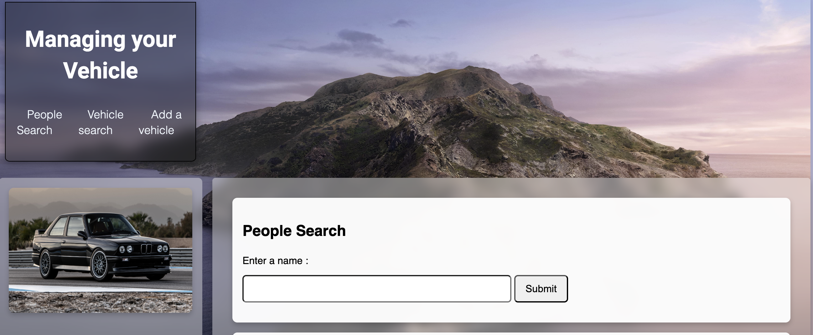

# Vehicle & People Management App 🚗

A responsive web application for managing people and vehicle records, built with JavaScript, HTML, and CSS, with a Supabase (PostgreSQL) backend.

## Features
- Search people by name (partial matching)
- Search vehicles linked to owners
- Add new owners and vehicles
- Input validation (e.g., duplicate license prevention, missing fields)
- Responsive design with grid/flexbox
- Accessibility improvements (100/100 score)
- Automated Playwright tests (14/14 passed)

## Tech Stack
- Frontend: HTML, CSS (Grid/Flex, media queries), JavaScript
- Backend: Supabase (PostgreSQL via supabase-js)
- Testing: Playwright

## Screenshots

## Getting Started
1. Clone the repo  
2. Create a `.env` with your Supabase keys  
3. Open `index.html` in a browser  

## Status
Completed as part of a university coursework project (2025).
